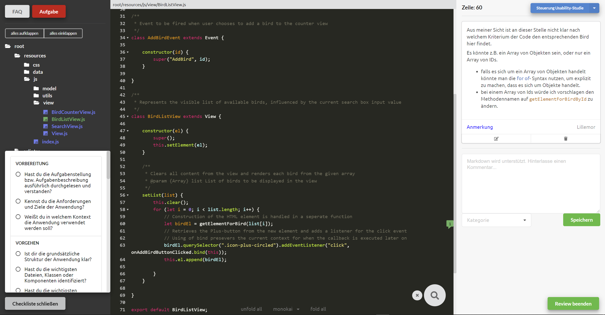

# Abschlussarbeit

In this rather poorly named repository you will find a code review editor.
This code review editor is designed as a self-suffiecient component that can be added
into any code-review platform or tool. The code review editor displays code files
in an IDE like manner and allows line based commenting in each file.
A file tree for any repository can be displayed. Features for code navigation and
understanding aim at helping the reviewer conduct a meaningful code review.
A checklist provides useful advise on code review.
This code review editor currently only fully supports projects with common web technologies (javascript, HTML, CSS and markdown).
It is only available in German at this point.

While the developement focus was on the code review editor, in fact this
repository also contains a platform to run the editor. This platform is
a remote usability studie that was conducted to test the code review editor.
It guides the user during the study, provides usability tasks and surveys.
It also loads the appropriate state and starts the code review editor.
The editor itself collects log data on the user interaction and reports it
back to the test plattform. Log data is then stored in a redis database.
All other data is saved in the sqlite db `StudyResults.db`.

## Prerequists

Since this code review editor is a web application any modern browser can support it.
Serverside prerequisites are an environment that can run `node.js`

## Getting started

First install the necessary packages `npm install` then start the server by running `npm start`.
Navigate to your URL. For a local environment this should be `localhost:8000\app`.

For a production environment run `npm install` and `npm run prod:start`.

## Documentation

While there is no documentation in the repository all code in the code review editor
has been documented using jsdoc comments inside the code.
You can always generate yourself an up to date documentation using the `jsdoc` cli like so:

`jsdoc -r ./app/res/js/review-editor`

# Background information on the code review editor

## Technology

This code review editor is implemented as a web app.
Its built on `Vue.js` because of its built in reactivity, making updates and re-rendering
of the DOM automatic and hastle free. Many of the editors main features are provided
by `codemirror`. Codemirror is a highly costumizable browser based code editor.
I use code folding, search, linting and code highlighting. The comment feature was originally adopted from by `side-comments`
but it has been completely rebuilt because its original implementation was not compatible
with `Vue.js` as the underlying framework as well as `codemirror`. Markdown is heavily used
in the application in order to display formated text. In order to transform mardown into
html the package `snarkdown` is utilized. Especially for linting and other features
the code review editor pulls alot of packages form content delivery networks. In order to
keep loading times short, packages are loaded asynchronous as much as possible and in
a way that they can be cached by the browser.

## Architecture

The application is split up into small `Vue.js` components. These are View-Controllers handling
their respective user inputs and DOM node(s). Every component is implemented as dumb display unit.
No logic or data-model related code is part of a component. The store module serves as the data-model
for the code review editor. The store holds an object called `state` which is a data-model representing
the websites content. The Vue components simply display the current `state`. If the `state` changes,
the DOM is immidiatily updated thanks to Vues built in reactivity.
The `state` can only be manipulated by calling setter methods in the store module. These methods
reporesent the logic-unit of the codereview editor. They run sanity checks on the input data and
assign it to the correct properties in the `state`.
At the moment the `state` is saved in the browsers local storage, this should change in the future.
The code-review editor also only runs on dummy data. The future goal is to pull repositories from
github for review.
